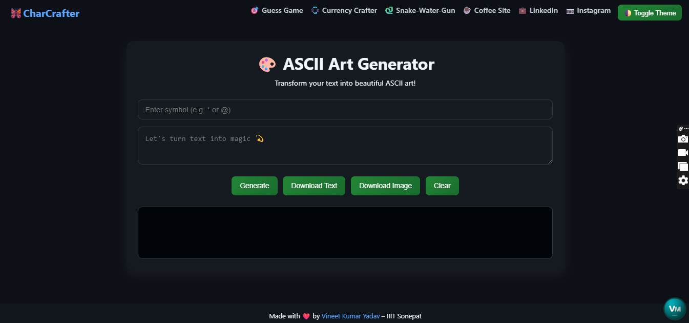

# 🔡 CharCrafter

**CharCrafter** is a clean and creative symbol-based ASCII Art Generator that transforms your custom text into artistic visual patterns using your chosen characters like `*`, `@`, `#`, etc. The tool is built with a beautiful and responsive UI, dark mode toggle, and download options.

🌐 **Live Demo**: [CharCrafter on GitHub Pages](https://vineet112111.github.io/CharCrafter/)

---

## ✨ Features

- 🔡 Converts text into ASCII-style visual art
- 🔣 Use any symbol (e.g., *, @, #) to create custom patterns
- 🌓 Light and Dark mode toggle
- 💾 Download as Text or Image
- 📋 Copy output to clipboard
- 📱 Fully responsive (works on mobile too)
- 💡 Real-time rendering

---

## 📸 Screenshot

 

---

## 🛠️ Tech Stack

- **HTML5**
- **CSS3**
- **JavaScript (Vanilla)**
- **html2canvas.js** for image download
- **GitHub Pages** for live hosting

---

## 🚀 How to Use

1. Enter your message (e.g., `HELLO`)
2. Enter a symbol (e.g., `#`, `*`, `+`)
3. Click “Generate”
4. Copy, download, or toggle theme as needed!

---

## 🔗 Related Projects

- 🎯 [Guess the Number Game](https://vineet112111.github.io/Guess-the-number-game/)
- 💱 [Currency Crafter](https://vineet112111.github.io/Currency_Crafter/)
- 🐍 [Snake-Water-Gun Game](https://vineet112111.github.io/Snake-Water-Gun-Game/)
- ☕ [Coffee Site](https://vineet112111.github.io/Coffee/)

---

## 👨‍💻 Author

**Made with ❤️ by Vineet Kumar Yadav**

🎓 *B.Tech (Information Technology) – IIIT Sonepat*  
📫 Email: [vineetyadav8429@gmail.com](mailto:vineetyadav8429@gmail.com)  
🔗 [LinkedIn Profile](https://www.linkedin.com/in/vineet-yadav-68059533a/)  
📸 [Instagram](https://www.instagram.com/vineet___alvi/)

---

## ⭐ Show Your Support

If you liked the project, consider giving it a ⭐ on GitHub and sharing it with your peers!

---

